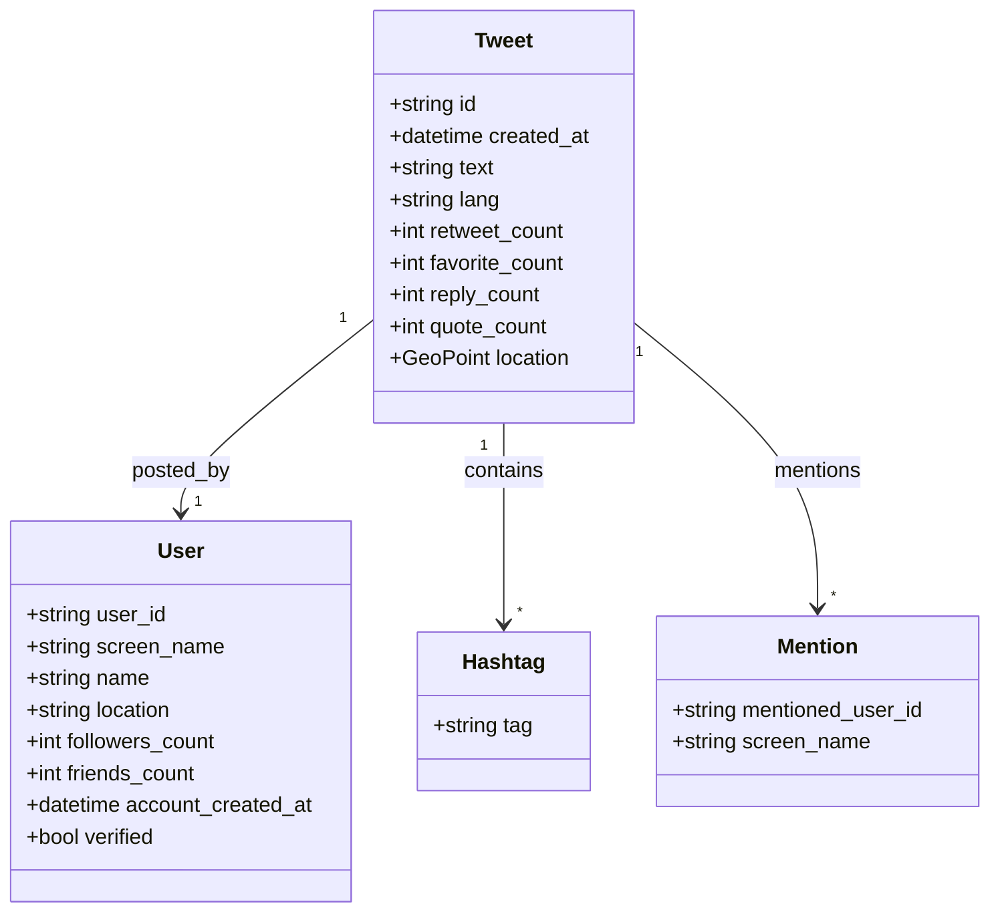

```mermaid
classDiagram
    class Tweet {
      +string id
      +datetime created_at
      +string text
      +string lang
      +int retweet_count
      +int favorite_count
      +int reply_count
      +int quote_count
      +GeoPoint location
    }

    class User {
      +string user_id
      +string screen_name
      +string name
      +string location
      +int followers_count
      +int friends_count
      +datetime account_created_at
      +bool verified
    }

    class Hashtag {
      +string tag
    }

    class Mention {
      +string mentioned_user_id
      +string screen_name
    }

    Tweet "1" --> "1" User : posted_by
    Tweet "1" --> "*" Hashtag : contains
    Tweet "1" --> "*" Mention : mentions
```
